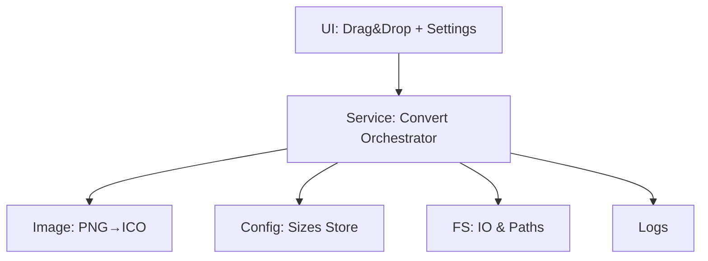

# Design Document

## Overview

本设计文档面向“基于 HTML 的 PNG→ICO 转换应用”。应用以轻量本地 GUI 为核心，支持拖放单/多 PNG 文件，按配置生成包含多尺寸的 .ico 文件，并在源文件目录输出。强调模块化、可扩展、隐私本地化处理与良好可观测性。

## Steering Document Alignment

暂无项目级 steering 文档，遵循通用前端工程与本地应用最佳实践。

### Technical Standards (tech.md)
- 图像处理采用专用库封装（如 Canvas/离屏渲染或跨平台图像库），统一导出 `generateIcoFromPngBuffers` 接口。
- 配置持久化采用本地文件（如 `~/Library/Application Support/<AppName>/config.json` 或应用内可写目录），提供 `getLastSizes`/`saveSizes` 接口。
- 文件系统访问统一经 `fs-service`（读/写/存在性/覆盖策略判断）。

### Project Structure (structure.md)
- 采用清晰的目录划分：`ui/`、`services/`、`image/`、`config/`、`types/`、`logs/`。

## Code Reuse Analysis

当前为空项目，无可复用代码；设计以通用接口为抽象，便于未来替换实现（如更换图像库）。

### Existing Components to Leverage
- N/A

### Integration Points
- 操作系统文件系统（读写、权限）。
- 本地配置文件路径解析（macOS 用户目录）。

## Architecture

采用分层架构：
- UI 层（HTML/轻量 TS/JS）：拖拽、尺寸设置、进度与结果展示。
- Service 层：批处理协调、任务队列、错误聚合、覆盖策略、日志写入。
- Image 层：PNG 读取、缩放、像素格式转换、ICO 多图标合成。
- Config 层：用户尺寸配置的读取与写入。
- FS 层：源目录检测、输出存在性判断、原子写入与回滚保护。

### Modular Design Principles
- 单文件职责：每个模块只解决一个问题（UI、配置、图像、文件）。
- 组件隔离：UI 不直接接触图像库，统一通过服务接口。
- 服务分离：图像转换纯函数化，服务协调副作用（IO/并发）。
- 工具模块化：尺寸解析、路径拼接、命名策略单独封装。



## Components and Interfaces

### UI: DragDropPanel / SettingsPanel
- Purpose: 接收拖拽文件、展示结果；设置并保存尺寸。
- Interfaces:
  - onFilesDropped(files: File[]): void
  - onSaveSizes(sizes: number[], overwrite: boolean): void
- Dependencies: Service API

### Service: convertService
- Purpose: 协调整批处理、并发控制、覆盖策略、结果聚合。
- Interfaces:
  - convertFiles(inputs: FileInput[], options: { sizes?: number[], overwrite?: boolean }): Promise<BatchResult>
- Dependencies: imageLib, fsService, configStore, logger

### Image: imageLib
- Purpose: 将单个 PNG Buffer 生成 ICO（多尺寸）。
- Interfaces:
  - generateIcoFromPngBuffers(buffers: Buffer[], sizes: number[]): Promise<Buffer>
  - resizeTo(buffer: Buffer, size: number): Promise<Buffer>
- Dependencies: 图像基础库（如 Canvas、sharp 或自研）

### Config: configStore
- Purpose: 读取/写入用户最近尺寸配置与默认覆盖策略。
- Interfaces:
  - getLastSizes(): Promise<number[]>
  - saveSizes(sizes: number[]): Promise<void>
  - getOverwriteDefault(): Promise<boolean>
  - setOverwriteDefault(value: boolean): Promise<void>
- Dependencies: fsService

### FS: fsService
- Purpose: 文件读写、命名与存在性检查。
- Interfaces:
  - readPng(filePath: string): Promise<Buffer>
  - writeIco(filePath: string, data: Buffer, overwrite: boolean): Promise<void>
  - deriveOutPath(pngPath: string): string // .png → .ico
  - ensureDirWritable(dir: string): Promise<void>
- Dependencies: Node / 平台 API

### Logger: logger
- Purpose: 记录转换摘要与错误细节。
- Interfaces:
  - info(message: string, meta?: any): void
  - error(message: string, meta?: any): void
  - getLogPath(): string

## Data Models

### FileInput
```
- sourcePath: string
- fileName: string
- directory: string
```

### BatchResult
```
- total: number
- succeeded: number
- failed: number
- items: Array<{
    inputPath: string
    outputPath?: string
    error?: { code: string; message: string }
  }>
```

### Settings
```
- sizes: number[] // e.g., [16,32,48,64,128,256]
- overwrite: boolean
```

## Error Handling

### Error Scenarios
1. 非 PNG 或损坏图片
   - Handling: 跳过并记录 `code=INVALID_INPUT`，提示用户。
   - User Impact: 结果列表显示失败原因。
2. 无写权限
   - Handling: 抛出 `code=EACCES`；提示授权步骤。
   - User Impact: 显示“无法写入目录”。
3. 覆盖冲突
   - Handling: 当 `overwrite=false` 且目标存在，记录 `code=EEXIST`。
   - User Impact: 显示冲突摘要，可引导更改设置重试。
4. 超大图片导致内存/超时
   - Handling: 设置最大像素阈值与超时；记录 `code=RESOURCE_LIMIT`。
   - User Impact: 友好提示“源图过大”。

## Testing Strategy

### Unit Testing
- 尺寸解析与命名策略（.png → .ico）。
- 配置存取与默认值回退逻辑。
- 图像缩放质量（对齐/抗锯齿开关）与 ICO 合成接口契约。

### Integration Testing
- 拖拽单/多文件到 UI，批处理回调与结果聚合。
- 权限不足/覆盖冲突路径。

### End-to-End Testing
- 以真实 PNG 资源进行端到端转换，验证源目录写出、并发稳定性与结果摘要展示。
